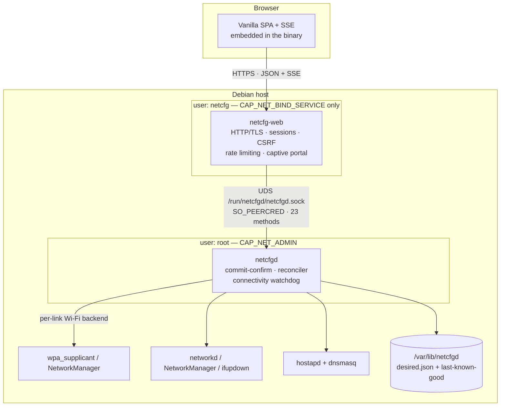
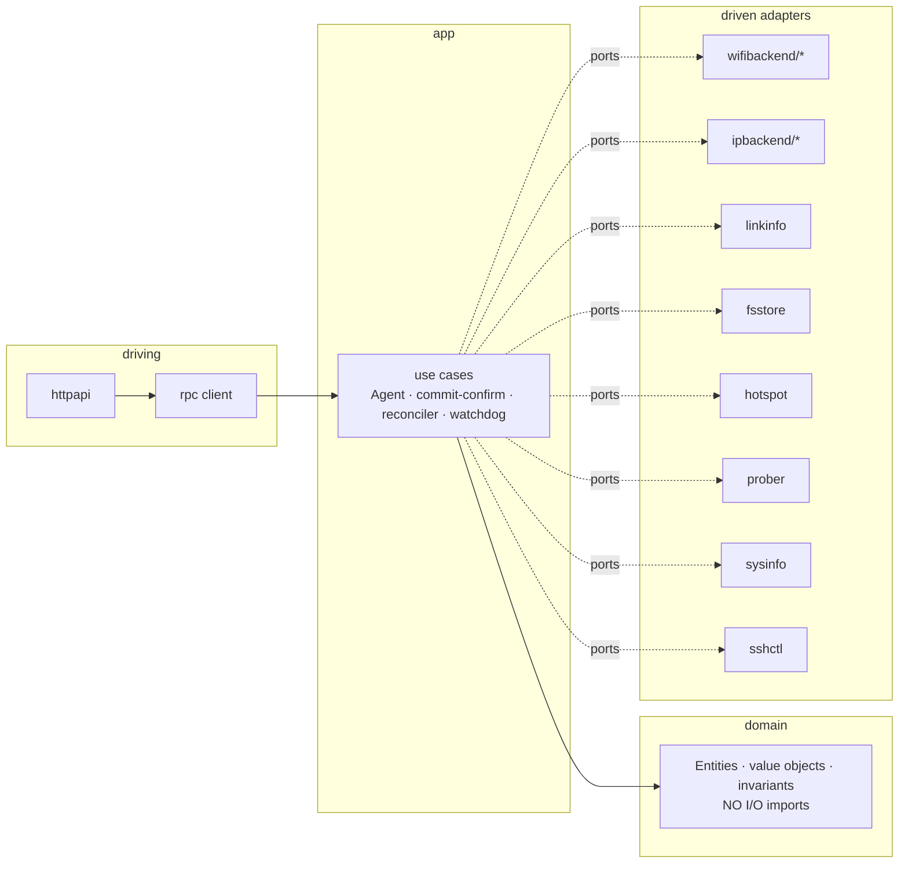
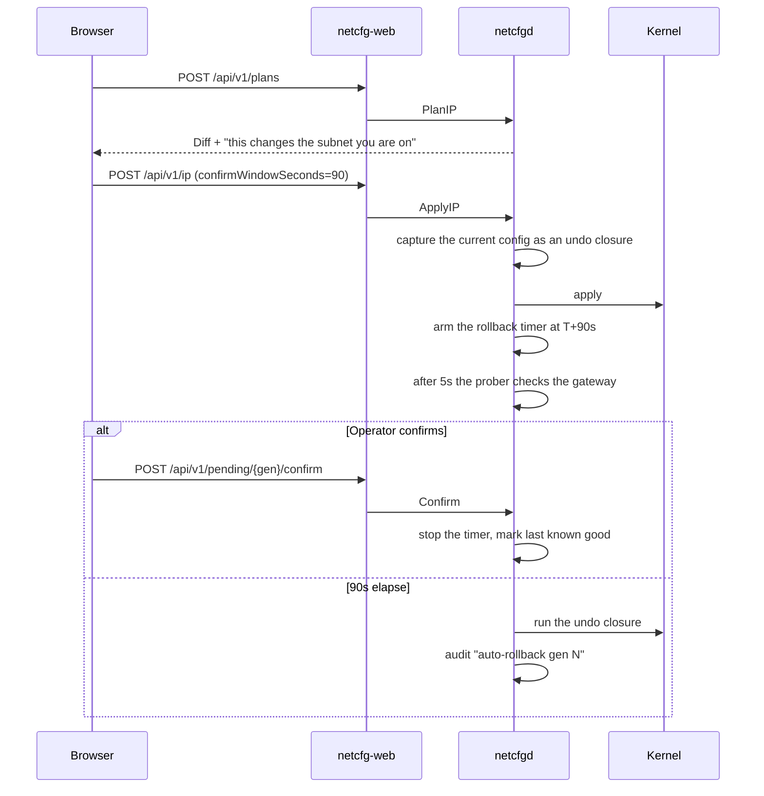

# Architecture

## Context

| Item | Detail |
|---|---|
| Users | On-site technicians, via a browser on the LAN or on the fallback AP |
| Devices | Debian 12+, usually ARM, 256MB–2GB RAM, no display |
| Core paradox | The application configures the very network that serves it |
| NFR priority | Lockout safety > Security > Diagnosability > Performance |

Performance ranks last on purpose: the load is a single user, but one wrong apply kills a physical device in the field.

## Container view



Splitting the processes buys **two** things, not just security:

1. The network facing attack surface runs without privileges.
2. The rollback timer survives a crash of the web tier. If the timer lived inside `netcfg-web`, a single crash would strand a dangerous change forever.

## Layering — Ports & Adapters



The rule: all dependencies point inward. `internal/domain` imports only the standard library and `internal/kdf`.

## Package layout

```
cmd/
  netcfgd/            privileged agent
  netcfg-web/         user interface process
internal/
  domain/             Link, IPPlan, WiFiRequest, Secret, HotspotConfig, DesiredState
  ports/              interfaces the application layer depends on
  app/                Agent, commit-confirm, reconciler, AP watchdog
  adapters/
    wifibackend/      registry choosing wpa_supplicant or NetworkManager per link
      nmwifi/         NetworkManager radio control through nmcli
    wpactrl/          pure Go control socket protocol client
    ipbackend/        registry + networkd / nm / ifupdown
    hotspot/          hostapd + dnsmasq
    linkinfo/         reads /sys, /proc and net.Interfaces
    prober/           post-apply connectivity checks
    sysinfo/          CPU, memory, disks and discovered sensors from /proc and /sys
    sshctl/           opens the SSH server for a diagnostic window
    store/fsstore/    desired state, last known good, history
    sysexec/          safe external command execution
  rpc/                protocol between the two processes
  httpapi/            API v1, SSE, auth, captive portal, embedded assets
  platform/           auth, certs, clock, eventbus, fileutil, logging
  kdf/                dependency-free PBKDF2
```

## State model

Configuration is **declarative**, not imperative:

```
Operator → DesiredState (generation N) → reconciler diff(desired, observed) → adapters
```

- `desired.json` — what the operator asked for
- `last-known-good.json` — the confirmed configuration, the rollback target
- `history/` — the last 20 snapshots for post-mortem analysis

This makes applying **idempotent**, provides a `Diff` for previews, and means a reboot cannot silently lose the configuration (the agent reconciles at startup).

## Commit–confirm flow



The `Prober` result is **advisory display only**; it never auto-confirms. Only a real request from the browser proves the operator still has access, which is exactly what needs proving.

Three escape hatches cover the special cases:

| Situation | Mechanism |
|---|---|
| Harmless change (DNS only) | Committed immediately, no prompt |
| Deliberately moving the device to another network | `noRollback: true` |
| Even the rollback cannot save it | The fallback AP starts by itself |

## Decision records

| ADR | Decision | Rationale | Trade-off |
|---|---|---|---|
| 001 | Two processes, RPC over a Unix socket | Privilege isolation; the timer survives a web tier crash | One more unit and a codec |
| 002 | Desired state plus reconciler | Idempotent, diffable, rollback falls out naturally | More machinery than calling commands directly |
| 003 | Commit-confirm with a prober | Addresses the number one risk: lockout | The operator has to press confirm |
| 004 | Pure Go `wpactrl` instead of `wpa_cli` | No secrets in argv, and an event stream | ~150 lines of protocol to maintain |
| 005 | Multi-backend IP registry | Never fights NetworkManager | Three adapters to maintain |
| 006 | Zero dependencies, standard library only | Offline cross-compiles, no supply chain CVEs | Hand written PBKDF2 instead of Argon2id |
| 007 | Build-free frontend (vanilla + SSE) | No Node in the build pipeline | No component ecosystem |
| 008 | Sessions persisted as digests | A restart does not sign the operator out mid-window | One more state file to clean up |
| 009 | Fallback AP uses WPA2 with published defaults | A credential only readable from the interface is useless to somebody who cannot open the interface | Anyone in radio range can join and see the sign-in page, so real deployments must pin `-ap-passphrase` |
| 010 | Captive portal on plain HTTP port 80 | Operating systems refuse to follow a redirect into a self-signed HTTPS endpoint | Requires `CAP_NET_BIND_SERVICE` |

**ADR-007 flips** once the UI passes roughly 1500 lines of JavaScript: move to Preact plus esbuild, still embedded statically.

## Concurrency and ordering

- `Agent.applyMu` serialises every configuration change; the network is a single resource.
- Exactly **one** `PendingApply` may exist at a time; a second request gets `409 Conflict`.
- `wpactrl` keeps two sockets per interface: one for commands, one for the event stream.
- The event bus fans out without blocking: a slow subscriber drops events rather than stalling the agent.

## Error handling

`domain.Error` carries a classification code (`invalid_input`, `not_found`, `conflict`, `unavailable`, `internal`) across the RPC boundary, and `httpapi` maps it to an HTTP status plus an RFC 9457 document. Internal errors are logged in full but reported generically, so no implementation detail leaks.
