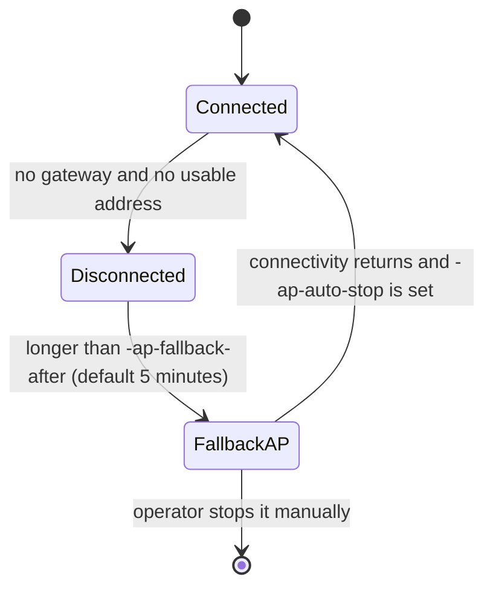

# Networking: backends, dual stack and the fallback AP

## Choosing an IP backend

Debian ships three network management systems and they are **mutually exclusive**. Writing configuration through the wrong one is the classic cause of flapping links: two managers fighting over the same interface.

`ipbackend.Registry` probes them in priority order and routes **per link**:

| Priority | Backend | Detection | Write path |
|---|---|---|---|
| 1 | NetworkManager | `nmcli device status`, skipping `unmanaged` devices | `nmcli connection modify` then `up` |
| 2 | systemd-networkd | `systemctl is-active` plus `networkctl list` | `/etc/systemd/network/10-<link>.network`, then `networkctl reload/reconfigure` |
| 3 | ifupdown | `ifup` present and `/etc/network/interfaces` sources `interfaces.d/*` | `/etc/network/interfaces.d/<link>`, then `ifdown/ifup` |

NetworkManager comes first because it claims devices exclusively when it runs.

Detection results are cached for 20 seconds. If no backend claims the link, the API returns `503` with each backend's specific reason instead of silently doing the wrong thing:

```json
{
  "status": 503,
  "detail": "no IP management backend detected (network-manager: nmcli is not installed; systemd-networkd: networkctl is not installed; ifupdown: ifupdown is not installed)"
}
```

## Choosing a Wi-Fi backend

The radio has the same exclusivity problem as the IP layer, and it bites harder. When NetworkManager runs the show it launches `wpa_supplicant` itself with a private control interface, so the socket under `/run/wpa_supplicant/` that this project would normally talk to **never appears**. Talking to the supplicant directly is not merely impolite there; it is impossible.

`wifibackend.Registry` mirrors the IP registry and routes **per link**:

| Priority | Backend | Detection | Control path |
|---|---|---|---|
| 1 | NetworkManager | `nmcli device status` lists a `wifi` device that is not `unmanaged` | `nmcli device wifi` / `nmcli connection` |
| 2 | wpa_supplicant | a control socket exists under `/run/wpa_supplicant/` | the control protocol over that socket |

Ownership is cached for 20 seconds, so a scan does not shell out to `nmcli` twice.

When nobody claims a link, the registry names **every** backend and why it stepped aside, rather than reporting whichever one happened to be last:

```json
{
  "status": 503,
  "detail": "no Wi-Fi backend detected (network-manager: nmcli is not installed; wpa_supplicant: no control sockets in /run/wpa_supplicant; check wpa_supplicant@<link>.service)"
}
```

A link that simply is not wireless produces a different, narrower error, so "nothing works on this host" stays distinguishable from "eth0 has no radio".

### Adding a backend

Write one type satisfying `ports.WiFiBackend` — the nine `Supplicant` methods plus:

```go
Kind() domain.WiFiBackendKind          // names itself, e.g. "iwd"
Detect(ctx) ([]string, error)          // the links it drives, or why it cannot
```

Then pass it to `wifibackend.New` in priority order in `cmd/netcfgd/main.go`. Nothing above the registry changes: the agent depends on `ports.Supplicant`, which the registry satisfies. `iwd` and ConnMan would both slot in this way.

Two things a new backend must get right. `Detect` should return a *useful* error — it is concatenated into the message above and is often the only clue the operator gets. And `domain.WiFiBackendKind` is a free-form string, so a backend names itself without this shared file needing an edit.

### What differs between the two current backends

The API speaks in the numeric profile ids wpa_supplicant invented. NetworkManager identifies connections by UUID instead, so the adapter folds the UUID into a stable non-negative int with FNV-1a and matches on that when selecting, reading or deleting a profile. The mapping is derived, never stored, so it survives restarts on both sides. A future backend with string identifiers faces the same tax; the honest fix is to widen `domain.Profile.ID`, which is a breaking API change.

Signal strength also differs: `nmcli` reports a 0-100 bar where wpa_supplicant reports dBm. The adapter converts to dBm so a single scale reaches the interface.

Saved passphrases come back only because `nmcli -s` is used; without it NetworkManager prints `<hidden>`. NetworkManager stores what the operator typed rather than a derived key, so a revealed secret is always the passphrase itself.

## IPv4 / IPv6 dual stack


`IPPlan` carries **two** independent modes:

| Field | Allowed values |
|---|---|
| `mode` (IPv4) | `dhcp` · `static` · `disabled` |
| `mode6` (IPv6) | `auto` (RA/SLAAC/DHCPv6) · `static` · `disabled` |
| `metric` | Route metric of the default route, both families; `0` keeps the backend default |
| `noDefaultRoute` | Link takes an address but installs no default route, leaving the failover order |
| `dns` | Mixed families; backends split it where the syntax demands it |

Validation rules:

- Addresses must match their family — putting `2001:db8::1/64` in the IPv4 field is rejected, and vice versa.
- An IPv4 gateway **must** lie inside the declared subnet.
- An IPv6 gateway is **not** subject to that rule: a link-local next hop such as `fe80::1` is normal and sits outside the prefix.
- Both families cannot be disabled at once.
- Addresses are always parsed and re-serialised through `net/netip`, so a hostile string can never inject a directive into a generated file.

### How each backend interprets a plan

**systemd-networkd**

```ini
[Network]
DHCP=ipv4                    # mode=dhcp; "no" when static or disabled
IPv6AcceptRA=yes             # mode6=auto; "no" when static or disabled
LinkLocalAddressing=ipv4     # only when mode6=disabled, drops the link-local address too
Address=192.168.1.50/24
Address=2001:db8::10/64
Gateway=192.168.1.1
Gateway=fe80::1
DNS=1.1.1.1
```

**NetworkManager** uses per-family keys: `ipv4.method` (`auto`/`manual`/`disabled`), `ipv6.method` (`auto`/`manual`/`disabled`), and `ipv4.dns` / `ipv6.dns` split by family with matching `ignore-auto-dns` flags.

**ifupdown** emits two stanzas:

```
auto eth0

iface eth0 inet static
    address 192.168.1.50
    netmask 255.255.255.0
    gateway 192.168.1.1
    dns-nameservers 1.1.1.1

iface eth0 inet6 static
    address 2001:db8::10/64
    gateway fe80::1
```

IPv6 uses prefix notation while IPv4 uses `netmask`. This was a real bug once: the four byte netmask helper applied to an IPv6 address silently produced `255.255.255.255`. The test `TestRenderIPv6UsesPrefixNotNetmask` locks that behaviour down.

### Current limits

- One address per family per link.
- No privacy extensions, no fine-grained `accept_ra`, no separate DHCPv6 tuning.
- No VLAN, bridge or bonding.

## Wired / Wi-Fi failover

Failover between two live links is decided by the **route metric**: the kernel
sends traffic through the default route with the lowest metric and falls back to
the next one when that link drops. That much is pure kernel routing, so on its
own it only reacts to a link going down, not to a gateway that stays up but
stops forwarding. The [active monitor](#active-monitoring) below covers the
second case.

A wired-primary device therefore looks like this:

```
default via 192.168.2.1 dev eth0  metric 100
default via 192.168.2.1 dev wlan0 metric 600
```

`metric` is part of `IPPlan`, so the same value reaches every backend:

| Backend | Written as |
|---|---|
| systemd-networkd | `[DHCPv4] RouteMetric=` and `[IPv6AcceptRA] RouteMetric=`; a **static** gateway moves into a `[Route]` section, because `[Network] Gateway=` cannot carry a metric |
| NetworkManager | `ipv4.route-metric` and `ipv6.route-metric`; `-1` restores NetworkManager's own default |
| ifupdown | `metric` inside the `iface` stanza |

Taking a link out of the order entirely (`noDefaultRoute`) maps to
`UseGateway=no` for systemd-networkd and `never-default=yes` for NetworkManager.
ifupdown can only express it on a static stanza, by omitting the gateway; asking
for it on a DHCP stanza is rejected with an explanation rather than silently
ignored.

Changing a metric counts as **disruptive** and goes through commit–confirm. It
hands the default route to a different interface, which breaks the return path
of the operator's own session whenever the two links are not on the same subnet.

### Editing a file that already exists

systemd-networkd applies the **first** `.network` file whose `[Match]` accepts
the interface, in lexicographic order. Writing a fresh `10-wlan0.network` next
to a hand-written `20-wlan0.network` would therefore shadow it and silently drop
everything it configured — including the metric that made failover work.

The networkd backend scans its directory, matches each `[Match] Name=` pattern
against the link (globs and `!` negations included) and rewrites **that** file.
Only when nothing matches does it fall back to creating `10-<link>.network`.

### Active monitoring

Metrics alone cannot see a gateway that answers ARP, keeps the carrier up and
quietly stops forwarding. `netcfgd` therefore probes each candidate link on its
own and parks the ones that fail:

```
every 10s   probe each link that has a gateway, through that link only
3 failures  move its default route to metric 4000000000
2 successes move it back to the metric it had
```

The probe dials TCP out of one interface with `SO_BINDTODEVICE`, so the answer
describes *that* path rather than whichever one the routing table prefers. A
refused connection still counts as reachable: it proves a host replied.

Without `-probe-targets` the monitor tests each link's own gateway, which
catches a dead next hop. Point it past the gateway to catch an upstream that is
merely pretending to work:

```sh
netcfgd -probe-targets 1.1.1.1:53,9.9.9.9:53
```

Three properties keep this from making things worse:

- **Never the last one.** A link is demoted only while another candidate is
  healthy. A site-wide outage leaves the routing table untouched, so the device
  comes back on its own when the upstream does.
- **Kernel only.** Demotion is an `ip route replace`; no `.network` file, nmcli
  connection or `interfaces.d` drop-in is touched. A reboot, or restarting
  netcfgd, restores exactly what the operator configured.
- **Reversible.** The metric a link had before demotion is remembered and put
  back on recovery.

`GET /api/v1/failover` reports what the monitor sees, and the failover panel
shows it per interface: up or down, reachable or not, demoted or not. The agent
also pushes a `failover` SSE event whenever a link changes state.

Turn it off with `-failover-monitor=false`; the kernel's own link-down failover
keeps working either way. `-failover-interval`, `-failover-fails` and
`-failover-recovers` tune the rest.

## Fallback access point and captive portal

### The problem

A chicken-and-egg situation: reaching the web UI requires a network, and configuring the network requires the web UI. A brand new device, a device moved to another site, or a customer who changed the router password all turn a headless machine into a brick.

### How it works



When it triggers, `netcfgd`:

1. Tries to create a virtual `ap0` interface with `iw dev wlan0 interface add ap0 type __ap`.
   - Success → **concurrent mode**: the client role keeps running and scanning still works.
   - Failure → **exclusive mode**: `wpa_supplicant@wlan0` is stopped and hostapd takes the radio.
2. Assigns `192.168.4.1/24` to that interface.
3. Runs `hostapd` (WPA2, SSID `netcfg`, passphrase `12345678` unless pinned).
4. Runs `dnsmasq` handing out `192.168.4.50–150` plus **wildcard DNS** `address=/#/192.168.4.1`.

The wildcard DNS is what makes it a captive portal: every lookup resolves to the device, so the phone's connectivity check fails and the operating system pops up its sign-in window.

With `-portal-listen :80`, `netcfg-web` answers the probe URLs of each platform:

| Platform | Probe URLs |
|---|---|
| Android | `/generate_204`, `/gen_204` |
| Apple | `/hotspot-detect.html`, `/library/test/success.html` |
| Windows | `/ncsi.txt`, `/connecttest.txt` |
| GNOME/Ubuntu | `/canonical.html`, `/check_network_status.txt` |

The portal listener runs **plain HTTP**, not HTTPS: captive portal detectors refuse to follow a redirect into a self-signed certificate. That is why `netcfg-web` needs exactly one capability, `CAP_NET_BIND_SERVICE`.

### Fallback AP security

The AP uses **WPA2**, not an open network: an open one would let anyone in radio
range reach the portal.

The defaults are SSID `netcfg` and passphrase `12345678`, and both are
deliberately guessable. This network exists for an operator who cannot open the
interface, so a credential only readable *from* the interface would be useless
precisely when it is needed. The cost is real: the passphrase is the shortest
WPA2 accepts and is published here, so anyone within radio range can join,
reach the captive portal and see the sign-in page. Changing anything still needs
the administrator password.

On any device where that trade is not acceptable, pin your own before shipping:

```sh
netcfgd -ap-ssid site-42 -ap-passphrase 'something-only-you-know'
```

What is in use appears in three places for an operator working from the wired side:

```sh
journalctl -u netcfgd | grep "fallback access point"
curl -sk https://device:8090/api/v1/hotspot   # requires a session
# or: the "Tools" tab in the web interface
```

### Interaction with Wi-Fi configuration

In exclusive mode `wpa_supplicant` is stopped, so new Wi-Fi settings cannot be applied. `Agent.ApplyWiFi` detects this and stops the AP first — the operator does not have to do anything.

### Requirements

```sh
apt install hostapd dnsmasq iw
systemctl disable --now hostapd dnsmasq   # netcfgd manages these processes itself
```

Not every Wi-Fi chipset can run AP and station mode at the same time. Check first:

```sh
iw list | grep -A 8 "valid interface combinations"
```

Without support the system falls back to exclusive mode: it still works, it just cannot scan while the AP is up.

### Turning it off

If the device always has an Ethernet port for recovery, disable the automatic behaviour:

```sh
netcfgd -ap-fallback=false
```

The manual start button in the Tools tab keeps working.
