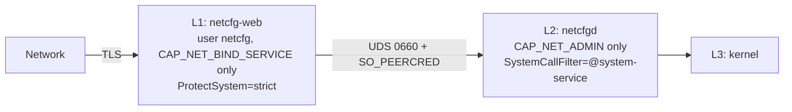

# Security

## Threat model

| Actor | Capability | Goal |
|---|---|---|
| Attacker on the LAN | Arbitrary requests to port 8090 | Take over network configuration, escalate to root |
| Attacker in radio range | Broadcast hostile SSIDs, join the fallback AP | Inject payloads via network names, reconfigure the device |
| Unprivileged local user | Run processes on the host | Read Wi-Fi credentials, call the root agent |
| Attacker with disk access | Read `/var/lib`, `/etc` | Replay sessions, recover passwords |
| Careless operator | Legitimate access | (not an adversary, but lockout must be prevented) |

## Defence in depth



## Controls

### Privilege separation

- `netcfg-web` runs as `netcfg` with `CapabilityBoundingSet=CAP_NET_BIND_SERVICE` (only to bind port 80 for the captive portal; drop it if unused).
- `netcfgd` runs as root but is constrained by `CapabilityBoundingSet`, `SystemCallFilter=@system-service`, and `ProtectSystem=strict` with an explicit `ReadWritePaths` list. Those paths carry a `-` prefix: a directory belonging to a subsystem the host does not have is skipped rather than failing the unit.
- The RPC socket is `0660` owned by group `netcfg`, and the agent additionally verifies `SO_PEERCRED` — a UID attached by the kernel that the connecting process cannot forge.
- netcfgd also grants that group search permission on the directory holding the socket, because a mode on the socket decides nothing if the caller cannot traverse its way there. It adds group `x` only, never widens the directory to everyone, and never narrows what an operator set deliberately.
- The RPC surface is deliberately narrow: 23 strictly typed methods. That is the entire reach the unprivileged process has into the root process.

### Opening the SSH server

Three of those methods can start the device's own SSH server for a diagnostic
session, which is a real widening of the attack surface. They are therefore off
unless `netcfgd` is started with `-allow-ssh`; otherwise they answer `503` and no
amount of access to the web tier changes that. The flag is set once at install
time, through `NETCFGD_OPTS` in `/etc/default/netcfgd`, so turning it on takes
root on the device rather than a session in the web UI.

When enabled, access closes again on a timer held by the root process, so a
forgotten session does not stay open. The timer is armed only when the
application was the one that opened SSH: a server the operator had already
enabled at boot is left exactly as found. A ufw rule added for the window is
withdrawn with it; nftables and iptables are reported but never edited, because
guessing at a rule set this project did not write is more dangerous than saying
so plainly.

### External command execution

- Every command runs through `exec.Command` with an argument slice, **never** through a shell.
- `PATH` is replaced with a fixed constant and the environment is cleared, so nothing can redirect us to a planted binary.
- Interface names are matched against the live device list before they reach a command or a file path.
- Every command has a timeout.

### Secret handling

| Secret | Treatment |
|---|---|
| WPA2 Wi-Fi passphrase | Converted to a 256-bit PSK (PBKDF2-SHA1, 4096 rounds) **before** leaving the process |
| WPA3 SAE passphrase | Sent hex encoded over the control socket, never through `argv`, so it cannot be read from `/proc/<pid>/cmdline` |
| Administrator password | PBKDF2-HMAC-SHA256, 240,000 rounds, 16 byte salt, constant-time comparison |
| Session tokens | Only a SHA-256 digest is written to disk; a leaked file cannot be replayed |
| Fallback AP passphrase | Defaults to a published value so a locked-out operator can join; override with `-ap-passphrase` |

The `domain.Secret` type prevents accidental leaks: `String()`, `GoString()`, `LogValue()` and `MarshalJSON()` all return `[REDACTED]`. Only `Reveal()` returns the real value, which makes every escape point greppable.

### Config file generation

Every value is **parsed and re-serialised** from its parsed form (`net/netip`, `net.ParseMAC`), never interpolated as a raw string. Input such as `192.168.1.1/24\nExecStart=/bin/sh` is rejected during normalization, before it reaches any template. `TestRenderCannotBeInjected` locks that behaviour down.

Files are written atomically (temp file, rename, directory fsync), so a power cut cannot leave a half written network configuration behind.

### Sessions and the web tier

| Control | Detail |
|---|---|
| Cookie | `HttpOnly`, `SameSite=Strict`, `Secure` when TLS is on. The name differs per scheme (`netcfg_session` vs `netcfg_session_http`) because a `Secure` cookie cannot be sent or overwritten from a plain HTTP origin, which otherwise strands the operator in a login loop after switching the listener |
| Session fixation | A completely new token after **every** login |
| Expiry | Sliding idle timeout (`-session-ttl`) plus an absolute lifetime (`-session-max`) |
| CSRF | Per-session token in `X-CSRF-Token` plus `Origin` / `Sec-Fetch-Site` checks |
| Password guessing | 5 failures locks the client IP for 5 minutes |
| Proxy spoofing | `X-Forwarded-For` is trusted only when the peer is listed in `-trusted-proxy` |
| Body size | Capped at 16 KB with `DisallowUnknownFields` |
| Headers | CSP without inline script, `nosniff`, `frame-ancestors 'none'`, `no-store`, HSTS when TLS is on |

### The user interface

SSIDs are attacker controlled data: anyone can broadcast an access point named ``. The whole DOM is built with `textContent`, never `innerHTML`, and the CSP blocks inline script, so a hostile network name cannot become executable code.

The `scan_results` parser has a fuzz test asserting that every SSID it returns passes `ValidateSSID`.

### Fallback access point

It uses WPA2 rather than an open network, but the default passphrase is published (`12345678`), so treat it as protecting against accident rather than against an attacker. Anyone in radio range can join and see the sign-in page; changing anything still requires the administrator password. Pin a real passphrase with `-ap-passphrase` on devices where radio range includes people you do not trust.

### Auditing

Every change is logged with the action, user, client address and generation. Logs go to journald:

```sh
journalctl -u netcfg-web | grep audit
journalctl -u netcfgd | grep -E "generation|rollback"
```

RPC parameters are **never** logged: `rpc.Request.LogValue()` emits only the ID and method name, because `params` may carry credentials.

## Considered and deliberately skipped

| Item | Reason |
|---|---|
| Argon2id instead of PBKDF2 | Requires `golang.org/x/crypto`; ADR-006 keeps the build dependency free. PBKDF2 at 240k rounds is adequate for a single rate-limited local account |
| TOTP two-factor | These devices often have no accurate clock before the network is up |
| PAM integration | Requires cgo, which breaks static cross-compilation |
| mTLS | Sensible for large fleets; unnecessary for on-site deployments today |
| Encrypting the session file | The key would have to sit next to the file; SHA-256 digests already prevent replay |

## Reporting a vulnerability

There is no public process yet. Add a `SECURITY.md` before distributing widely.
